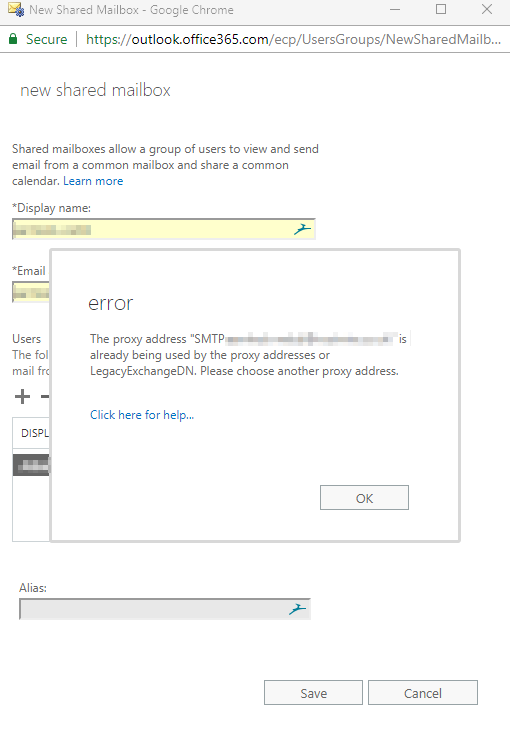

The proxy address is already being used by the proxy addresses of another mailbox

Why can't I create a mailbox at account@domain2.com if one already exists at account@domain1.com

## The Problem

So, you have two (or more) domains associated with your Office 365 Exchange account. When you try to create a shared mailbox on one domain, you encounter an error stating the proxy address is already being used.

### For example

* You have two domains, lets call them `domain1.com` and `domain2.com`
* You're trying to create a shared mailbox on `domain2.com` and you're hitting an error.

The message reads:

The proxy address "SMTP:name@domain.com" is already being used by the proxy addresses or LegacyExchangeDN. Please choose another proxy address."



## The Cause

This issue occurs because the Shared Mailbox we're trying to create is automatically assigned a **UserPrincipalName** on the **default domain** for the organisation, no matter which domain we try to create it on.

For example.

* You have a user, shared or resource mailbox already in existence on *domain1.com* with an alias of *finance@domain1.com*
* When you try to create the *finance@domain2.com* mailbox, Office365 tries to assign the *UserPrincipalName* as *finance@domain1.com*, this is already in use so O365 throws the error that we're seeing.

## The Fix

1. Connect to Office365 / Exchange as an admin via Powershell

    ```powershell
    $UserCredential = Get-Credential
    $Session = New-PSSession -ConfigurationName Microsoft.Exchange -ConnectionUri https://outlook.office365.com/powershell-liveid/ -Credential $UserCredential -Authentication Basic -AllowRedirection
    Import-PSSession $Session -DisableNameChecking
    ```

2. Remove the alias from the existing mailbox (don't worry, we'll add it back shortly!)

    **NOTE: If the conflicting alias is the default SMTP for the mailbox, you'll need to create a new temporary default SMTP alias before removing the conflicting one**

    ```powershell
    Set-Mailbox account@domain1.com -EmailAddresses @{remove="finance@domain1.com"}
    ```

3. Create the shared mailbox you want to create on **domain2.com**

    ```powershell
    New-Mailbox -Name finance@domain2.com -Shared
    ```

    The value for "**MicrosoftOnlineServicesID**" is the value of the MailBox Property "**WindowsLiveID**" and this defaults to your default domain, as explained in **The Cause** &#8211; <https://msdn.microsoft.com/en-us/library/ee423637(v=exchsrvcs.149).aspx>  
    We want to change this to our secondary domain to enable us to delete the default primary domain smtp alias.

    Ignore the warning that appears after you run the command.

    ```powershell
    Set-Mailbox finance@domain2.com -MicrosoftOnlineServicesID finance@domain2.com
    WARNING: UserPrincipalName "finance@domain1.com" should be same as WindowsLiveID "finance@domain2.com", UserPrincipalName should remain as"finance@domain2.com".
    ```

4. Remove the default smtp address from our new mailbox

    ```powershell
    Set-Mailbox finance@domain2.com -EmailAddresses @{remove="finance@domain1.com"}
    ```

5. Confirm that the removal was successful

    ```powershell
    Get-Recipient finance@domain2.com | select name, emailaddresses


    Name                EmailAddresses            
    ----                --------------            
    finance@domain1.com {SMTP:finance@domain1.com}
    ```

6. Add the **domain1.com** alias back to the email address.

    ```powershell
    Set-Mailbox account@domain1.com -EmailAddresses @{add="finance@domain1.com"}
    ```