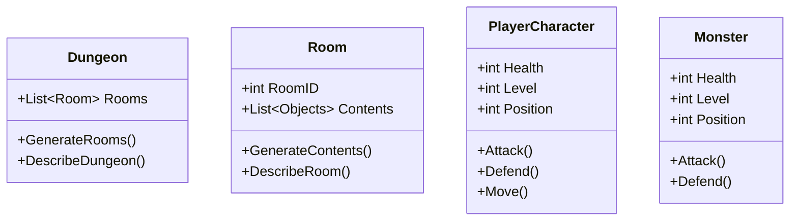
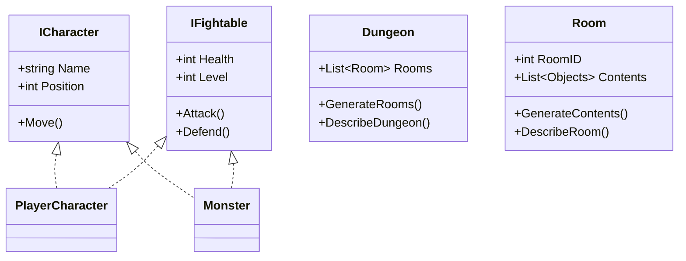

## Project link

First, the [project link](https://github.com/Aidenwebb/AxeheimMUD), for those of you who just want to gander at code and commit history

## Introduction

Last night was one of the worst nights sleep I've had in the past few years. I've always had trouble with insomnia, but have built a number of techniques to work through it and eventually sleep.
One of those techniques is to just get up and write down whatever comes to mind until my ADHD brain is quiet enough to sleep without sprinting through the supermarket shelves of ideation, scooping armfuls of ideas in to the shopping trolley of "Projects I should start".

And write I did! Among one of the many things that came up was "I want to learn C# / .NET Core, and I feel like I'm making reasonably good progress. I have lots of ideas for apps I want to make, but they're primarily solving business problems and at my current skill level none of them are going to be good enough for production. What would be a good project sufficiently complicated to maintain my interest, where I can start very simple and iteratively make improvements, where any bugs in the code aren't going to be extremely detrimental to the use of the project.

After another hour staring out the window at empty street outside our flat, watching the occasional bat flit through the sky eating mosquito's, the idea came to me. Why not make a text-based MUD?

## What is a MUD?

MUD stands for Multi-User-Dungeon. It's very much the grandfather of modern MMORPG's such as Runescape and World of Warcraft. Not nearly as polished, and typically without a GUI, they're primarily text-based, making it perfect for a simple console application without having to worry about graphics, sounds or real-time / reaction speed based event handling.

## Why a MUD?

Well, from a design perspective, we can start with a very simple project and build a lot more complexity as we go.
At the most basic level, we only need 4 components:

* The Player / Character
* Rooms in a dungeon
* Monsters in a room
* Treasure dropped by monsters, or found in a room

At a more complicated level, we can add:

* Character skills and variables, such as fighting, crafting, luck
* Status effects for skills, room environments, special abilities, monsters
* Various items equipable by the character, or monsters/npcs
* Different dungeons, either randomly generated or static
* Ways to gain or spend money found in rooms
* Adding a GUI / maps to rooms, allowing for 2 dimensional, or 3 dimensional rooms rather than a 1 dimensional room simply existing as a container of the things within.
* Adding 2d or 3d movement within a GUI map, rather than a player and monsters simply existing in a room, they could move around and between rooms.

### At a technical level

The control plane is simple - written text based commands sent to a console. I will need to learn about and build an interface for these text based commands and the response, so a telnet server will likely fill this function to begin with. At a later, more complicated level, developing an own client and a GUI and encoding the control protocol might be on the cards.

### At a motivational level

It's fun! I love RPG's and DnD. This has the potential to just be a big mess of unbalanced ideas, but that's OK, it's a project for fun. If for whatever reason it does take off, I certainly won't be complaining. As someone who used to run private game servers in my teens, I enjoy building a community of players, adapting the game to suit what players want, and knowing people are enjoying what I've built.

### At a risk level

If the server breaks, or data is lost, or there's a bug that leaks information, or the systems get hacked. That really sucks, but at least no-one is relying on it. Also, no GDPR protected personal information stored means a lot less stress.

### At an educational level

There's lots of concepts to learn at a basic level, and then deep dive in to if and when required.
For example:

* Client / Server communication. Start with Telnet, maybe at a later point REST with a web-page front end, or a custom/another protocol and a dedicated game client.
* Authentication / Authorisation - Users are going to need to log in to play their characters at some level. Likely rolling my own to begin with (a bad idea in production, but a good learning experience). All players have the same in-game permissions, but their characters may not be able to access some items/areas without the correct stats/quests completed, which is adjacent to Authorisation.
* Persistent data storage - in a database or in flat files. I'm thinking a graph database is a good fit for this kind of project. A big relational databased is likely to get complicated quickly.
* Game/interface design - Even business applications can benefit from elements of game design. When you're trying to drive the behaviour of a user to interact with your business application in the most productive way, understanding what draws people to take specific actions when faced with a particular scenario comes in handy.

## So where do we start?

### Designing the MVP, or more like a prototype

The absolute most basic base-product. Doesn't need reward cycles built at this point, only the basic fundamentals at this stage

* Single player
* Played in the local systems console

Concept:

* The dungeon:
  * A dungeon contains a randomly generated list of rooms.
  * Each room contains a monster, and an exit.
  * The monster in the room must be killed before moving to an exit.
* The player:
  * The player keeps track of how many monsters have been killed
  * The player starts in the first room of a randomly generated dungeon
  * When the player dies, their high-score is how many monsters they have killed, and they start a new randomly generated dungeon.

**"That sounds boring, you don't even have a choice as a player, it's just kill monster, next room, kill monster, next room"**

You're right, we do need to make this more fun, but at this stage, we just want something that works. A prototype.

Some idea's I've had about gameplay elements to make things more fun.

* Different monsters. Some might be flying and out of reach of a sword, but can be shot at, some might be armoured but susceptible to magic. Some might have elemental resistances or weaknesses. Some monsters might be able to be charmed, or spoken with, or dealt with in ways other than combat.
* Different attack styles for both players and monsters. Players might choose to prefer melee, ranged, or magical combat. Some players might want pacifist options.
* Different doors leading to different rooms. Different doors indicating the type of room or monster that might be behind it. Doors covered in vines, ice or hot to touch for example, allowing a player to choose their preferred next challenge.
* Monsters granting XP for killing them, which can be allocated to doing more damage, or increasing your health
* Monsters dropping items that can be equipped for particular affects, advantages or stat changes, or otherwise used throughout the dungeon

It's still "kill monster, next room", but now has a lot of elements of choice that allow players to develop strategy in tackling the dungeon.

**"But this isn't even a MUD, it sounds like a roguelike single player dungeon crawl"**

Yup, but it also makes the basis of a MUD to be. We add a level of abstraction and instead of "Dungeon" we have a "Map", within the Map, we have a list of "Areas" instead of "Rooms". "Areas" contain NPC's, monsters, items, trees etc, and can be navigated by players.

We can still use randomly generated dungeons per player if we want to, and access that through an area of the overall map.

### An admission of over-enthusiastic guilt

I actually designed the MVP after I'd already got started hacking together some basic code. A result of this is that I've added unneccessary complexity to the project before I've even started. To solve this I'll need to remove that complexity a this stage and re-impliment it later. For example, I've already started writing a TCPServer listener, and each room actually generates random exits, and the player class has controls to allow directional movement, which won't be useful until different exits have meaning.

The lesson learned? Hash out the MVP on paper before hacking around with code. It can also be a good idea to hash out your basic class diagrams too, so lets do that now.

### Hashing out the building blocks - Classes

Our basic 4 classes are:



Monster and Player Character look very very similar, so lets abstract out to another class.



So, lets go back to pure basics and impliment this.

First off, I'm going to move my master branch to a new branch called "firstproto", so I can develop this design separately to the small amount of work I've already done. That work may be useful at a later stage, it may not be. If it's not, I'll delete that prototype branch.

Second, I'm going to remake a "main" branch and a "dev" branch, I'll develop on the dev branch and pull in to main at key milestones. Sensible!

```bash
git checkout -b first-prototype // create prototype branch
git push origin first-prototype // push the origin to prototype branch
```

* Log in to Github, go to the repo settings > branches > set 'first-prototype' as the default branch

```bash
git push origin :master // delete the master branch
git checkout --orphan main
git checkout --orphan dev
```

* Created a Readme.MD on dev branch with a title only and saved.

```bash
git checkout dev
git rm --cached *
git status
git add README.MD
git commit -m "First commit - add readme"
git add .gitignore
git add .gitattributes
git commit -m "add gitattributes and .gitignore"
git push origin dev
git checkout main
git merge dev
git push origin main
git checkout dev
```

* Log in to Github, go to the repo settings > branches > set 'main' as the default branch
* Add files for each class/interface to be used in the program

Now the git mess is cleared up, and I've templated the project, that's where I'll leave it for now. The code is empty of any domain-specific code, and does nothing, but here we have a start! -
[Github commit](https://github.com/Aidenwebb/AxeheimMUD/commit/98cc43cabea2d6cbe1cec6c98612a7bb00bdb8ce)
