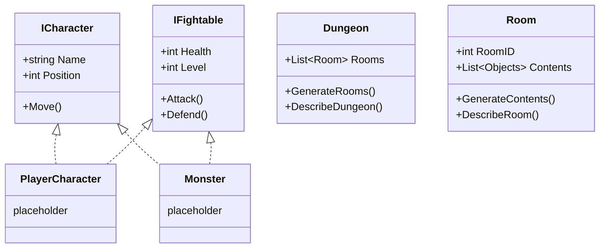

## Introduction
This is part 2 of a series. Part 1 is [here](/posts/learning-c-sharp-building-a-mud-part-1)

Last we left off, we'd designed our basic class diagram and templated out the file structure. Now is time to implement it.



## Implimenting our prototype

### ICharacter interface

Characters need a name and a position, and need some way to change their position (The `Move()` method).

```csharp
namespace AxeheimMUD.Core.Models;

public interface ICharacter
{
    string Name { get; }
    int Position { get; }

    void Move();
}
```

### IFightable interface

Some characters (and later other things) will be able to engage in combat, but not everything will be able to. We should also create a MaxHealth variable and clarify "Health" to be "CurrentHealth" too.

```csharp
namespace AxeheimMUD.Core.Models;

public interface IFightable
{
    int MaxHealth { get; }
    int CurrentHealth {get; }
    int Level { get; }

    void Attack();
    void Defend();
}
```

### Monster class
Monsters are a character and live in a specific room, they are also fightable.