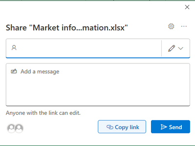
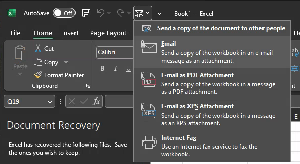

## The Problem

Microsofts latest update to Office 365 has changed the way "Share" function operates. Previously, when you clicked the "Share" button, you were presented with a list of options, including sharing a link, or attaching a copy of your document instead.

Now, if the file you are working on is already saved in a shareable OneDrive or Sharepoint locationsync'd, the only option you are presented is to share a link to the document. The "Send a Copy" option is missing.

## The Workaround

The workaround is to pin the Send menu to your quick access toolbar, which will then give you access to the Send A Copy function again.

### How to Pin the Send Menu

1. Right click on the Quick Access Toolbar and select `Customize Quick Access Toolbar`
2. In the left-hand column, select `All Commands` from the `Choose commands from` dropdown
3. In the left-hand column, scroll down to the `Send` menu and select it.
4. Click the `Add` button to add it to the Quick Access Toolbar
5. Click `OK` to save the changes
6. You should now see the Send menu in your Quick Access Toolbar
